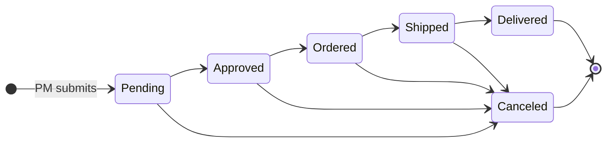

# Stockroom

[](https://github.com/arshnooramin/stockroom/actions/workflows/ci.yml)

Stockroom handles parts purchasing for team projects. Project managers request parts, admins review and place the orders, and everyone can see where each order stands and what each project has spent.

## Workflows

**Ordering**



1. A **project manager** submits an order: vendor, urgency, shipping speed, and one or more items with part number, price, quantity and justification.
2. **Admins** are emailed, and the order counts toward "Awaiting review" on their dashboard.
3. An admin moves the order through its statuses and adds courier, tracking link and shipping cost. The project's PMs are emailed on every status change.
4. PMs follow progress on their project page. They can delete an order only while it's pending.

**Administration**

- Admins create projects, assign one or more PMs by email, and export orders to Excel (one sheet per project).
- The **superuser** also manages admins and can reset all projects, orders and PMs for a new term.
- Access is invite-only: signing in proves who someone is, but they need an admin to add their email first.

| Role | Sees | Can |
| --- | --- | --- |
| Project manager | Their own project | Submit orders, delete pending ones |
| Admin | Every project | Update orders, manage projects and PMs, export |
| Superuser | Everything | Admin actions, plus manage admins and reset data |

## Local development

Requires Python 3.12+.

```sh
python -m venv .venv && source .venv/bin/activate
pip install -r requirements-dev.txt
cp .env.example .env              # set SUPERUSER_EMAIL
flask --app stockroom init-db
flask --app stockroom run --port 5001   # macOS uses port 5000 for AirPlay
```

`.env.example` turns on a development-only sign-in box that accepts any email without OAuth. Sign in as your `SUPERUSER_EMAIL`, create a project, then add PMs. Emails are logged instead of sent unless email is configured.

```sh
pytest
ruff check . && ruff format .
```

`flask --app stockroom seed-demo` fills an empty database with sample projects, orders, an admin (`admin@example.com`) and PMs (`pm.rover@example.com`, `pm.drone@example.com`), plus your `SUPERUSER_EMAIL` as superuser.

`init-db` only creates missing tables. After changing `models.py`, delete `instance/stockroom.sqlite` and run it again.

### With Docker

```sh
docker compose up --build    # http://localhost:8000, seeded with demo data
docker compose down -v       # stop and wipe the demo database
```

`docker-compose.yml` is for local use only: it enables dev sign-in, seeds demo data and reloads on code changes. The `Dockerfile`'s default command, used in production, never seeds and starts with an empty database.

## Configuration

All configuration comes from environment variables; [`.env.example`](.env.example) lists them all.

| Variable | Purpose |
| --- | --- |
| `SECRET_KEY` | Required in production |
| `DATABASE_URL` | Postgres URL; defaults to SQLite |
| `OIDC_CLIENT_ID`, `OIDC_CLIENT_SECRET` | OAuth client credentials |
| `OIDC_DISCOVERY_URL`, `OIDC_PROVIDER_NAME` | Defaults to Google; any OIDC provider works |
| `ALLOWED_EMAIL_DOMAINS` | Optional sign-in domain allowlist |
| `SUPERUSER_EMAIL` | Becomes the superuser on first sign-in |
| `MAIL_FROM` + `RESEND_API_KEY` or `MAIL_SERVER`… | Email via Resend or SMTP |

**Google sign-in:** in [Google Cloud Console → Credentials](https://console.cloud.google.com/apis/credentials), create an OAuth client ID of type *Web application* and add `https://<your-host>/auth/callback` as a redirect URI.
